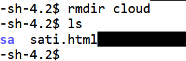
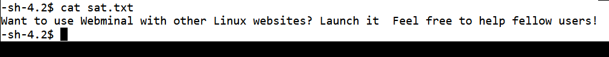
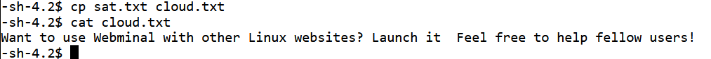
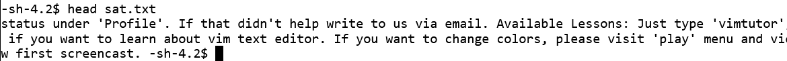
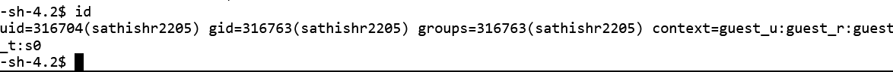
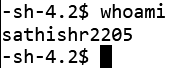

# Cloud Security Lab 1: Linux Commands Study

## Introduction to Linux

**Linux** is an open-source operating system, and its kernel is the heart of the OS, facilitating communication between hardware and software. One of the key advantages of Linux is its customizability; developers can modify the Linux kernel to create their own tailored operating systems.

## Linux Commands

Linux commands are executed in the terminal, which is case-sensitive. This guide covers some basic and advanced commands used in Linux.

### 1. `ls` Command  
```bash
ls
```
**Description:**  
The `ls` command is used to list the files and directories in the current working directory. It helps you view the contents of a directory. You can also add options to display more detailed information about the files.

**Output:**  


### 2. `pwd` Command  
```bash
pwd
```
**Description:**  
The `pwd` command stands for "print working directory." It shows the full path to the current directory you are working in.

**Output:**  


### 3. `mkdir` Command  
```bash
mkdir <directory_name>
```
**Description:**  
The `mkdir` command is used to create a new directory. You specify the name of the directory you want to create as an argument to this command.

**Output:**  


### 4. `rmdir` Command  
```bash
rmdir <directory_name>
```
**Description:**  
The `rmdir` command is used to remove an empty directory. It will not work if the directory contains files or other directories.

**Output:**  


### 5. `cd` Command  
```bash
cd <directory_name>
```
**Description:**  
The `cd` (change directory) command is used to move between directories. You specify the path to the directory you want to navigate to.

**Output:**  


### 6. `cat` Command  
```bash
cat [OPTION]... [FILE]...
```
**Description:**  
The `cat` command is used to display the contents of one or more files. It can also be used to concatenate files and display them.

**Output:**  


### 7. `cp` Command  
```bash
cp <source_file> <destination_file>
```
**Description:**  
The `cp` command is used to copy files or directories. You specify the source file and the destination file or directory.

**Output:**  


### 8. `head` Command  
```bash
head <file_name>
```
**Description:**  
The `head` command is used to display the first few lines of a file. By default, it shows the first 10 lines of the file.

**Output:**  


### 9. `id` Command  
```bash
id
```
**Description:**  
The `id` command is used to display the user ID (UID) and group ID (GID) of the current user, along with additional information about the user's groups.

**Output:**  


### 10. `whoami` Command  
```bash
whoami
```
**Description:**  
The `whoami` command displays the current username of the user who is logged into the terminal.

**Output:**  


## Result  
Hence, the basic linux commands were studied and executed successfully
